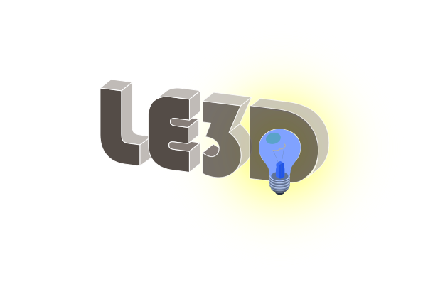

<p align="center">
  <a href="https://srameo.github.io/projects/le3d/">
    <br/>
  </a>
</p>

## <div align="center"><a href="https://srameo.github.io/projects/le3d/">Web Viewer</a> | <a href="https://srameo.github.io/projects/le3d/intro.html">Homepage</a> | <a href="https://arxiv.org/abs/2406.06216">Paper</a> | <a href="https://drive.google.com/drive/folders/1dJLT7YDHs28aKG0sRmmUm5Qeusp_37r0?usp=drive_link"> Google Drive</a> | <a href="docs/editor.md">Editor</a> | <a href="docs/README_cn.md">中文版</a>
<div align="center">

:newspaper: [**News**](#newspaper-news) | :wrench: [**Install**](#wrench-dependencies-and-installation) | :tv:[**Quick Demo**](https://srameo.github.io/projects/le3d/) | :camera: [Training and Editing](#camera-training-and-editing) | :construction: [**Contribute**](docs/develop.md) | :scroll: [**License**](#scroll-license) | :question:[**FAQ**](https://github.com/Srameo/LE3D/issues?q=label%3AFAQ+)

</div>

<span style="font-size: 18px;"><b>Note:</b> This repository is also a <span style="color: orange;"><a href="https://github.com/XPixelGroup/BasicSR">BasicSR</a> style</span> codebase for 3D Gaussian Splatting! Please feel free to use it for your own projects! If this repo helps you, please consider giving us a :star2:! </span>

<b>TL; DR:</b> LE3D is a project for fast training and real-time rendering for HDR view synthesis from noisy RAW images using 3DGS.

This repository contains the official implementation of the following paper:
> <b>L</b>ighting <b>E</b>very Darkness with <b>3D</b>GS: Fast Training and Real-Time Rendering for HDR View Synthesis<br/>
> [Xin Jin](https://srameo.github.io)<sup>\*</sup>, [Pengyi Jiao](https://github.com/VictorJiao)<sup>\*</sup>, [Zheng-Peng Duan](https://mmcheng.net/dzp/), [Xingchao Yang](https://scholar.google.com/citations?user=OkhB4Y8AAAAJ&hl=zh-CN), [Chongyi Li](https://li-chongyi.github.io/), [Chunle Guo](https://mmcheng.net/clguo/)<sup>\#</sup>, [Bo Ren](http://ren-bo.net/)<sup>\#</sup><br/>
> (\* denotes equal contribution. \# denotes the corresponding author.)<br/>
> arxiv preprint, \[[Homepage](https://srameo.github.io/projects/le3d/)\], \[[Paper Link](https://arxiv.org/abs/2406.06216)\]

<span style="font-size: 18px;"><b>Please note:</b> These videos are encoded using HEVC with 10-bit HDR colors and are best viewed on a compatible display with HDR support, e.g. recent Apple devices.</span>
<details>
  <summary>This is how we make the demo videos.</summary>

  https://github.com/user-attachments/assets/9e2a9755-14d5-4788-9393-7d0c7ae95486

  Just set the `KeyFrames`! All the interpolation will be done automatically! (BTW, you could set the acceleration of the camera motion in the `Interpolations`!)
</details>

https://github.com/user-attachments/assets/050f1c37-2667-4f9a-927f-5fffe1de9c9e

https://github.com/user-attachments/assets/440aa492-ed06-4519-8509-7d74c75f3275

Want to make your own 3D video story board? Please refer to [LE3D Editor](docs/editor.md) for more details.

- First of all, [:wrench: Dependencies and Installation](#wrench-dependencies-and-installation).
- For **quick preview**, please refer to our [web viewer](https://srameo.github.io/projects/le3d/).
- For **training and editing with your own data**, please refer to [:camera: Training and Editing](#camera-training-and-editing).
- For **further development**, please refer to [:construction: Further Development](#construction-further-development).

## :newspaper: News

> Future work can be found in [todo.md](docs/todo.md).

<ul>
  <li><b>Jan 15, 2025</b>: Update pretrained scenes on the <a href="https://bmild.github.io/rawnerf/">RawNeRF</a> dataset, can be seen in <a href="https://drive.google.com/drive/folders/1dJLT7YDHs28aKG0sRmmUm5Qeusp_37r0?usp=drive_link"> Google Drive</a>.</li>
  <li><b>Jan 8, 2025</b>: Code released.</li>
  <li><b>Jan 3, 2025</b>: Release a <a href="https://srameo.github.io/projects/le3d/">web demo</a> for LE3D! you could view your own recontructed HDR scene in real-time! Codes on <a href="https://github.com/Srameo/hdr-splat">hdr-splat</a>.</li>
  <li><b>Oct 10, 2024</b>: LE3D is accepted by NIPS 2024!</li>
</ul>
<details>
  <summary>History</summary>
  <ul>
  </ul>
</details>

## :wrench: Dependencies and Installation

### Prerequisites

> Note: We only tested on Ubuntu 20.04, CUDA 11.8, Python 3.10 and Pytorch 1.12.1.

- Nvidia GPU with at least 12GB VRAM. (Since the resolution for RAW images is relatively high, we recommend at least 16GB VRAM.)
- Python 3.10 installed.
- CUDA 11.8 installed.

### install.sh

We have provided a script for easy installation.

```bash
> ./install.sh -h
Usage: ./install.sh [options]
Options:
  -i|--interactive             Interactive installation
  -cuda|--install-cuda            Install CUDA
  -colmap|--install-colmap          Install COLMAP
      cuda_enabled          Enable CUDA support (must follow --install-colmap)
  -env|--create-env              Create and activate conda environment
By default, only Python packages will be installed
```

For interactive installation, you can run and select the options you want:

```bash
> ./install.sh -i
Do you want to install CUDA? Root permission required. (y/N): Y
Do you want to install COLMAP? Root permission required. (y/N): Y
Do you want to enable CUDA support? (y/N): Y
Do you want to create and activate a conda environment called 'basicgs'? (y/N): Y
----------------------------------------
INSTALL_CUDA: true
INSTALL_COLMAP: true
  COLMAP_CUDA_ENABLED: true
CREATE_ENV: true
INTERACTIVE: true
INSTALL_PYTHON_PACKAGES: true
----------------------------------------
...
```

or you can run `./install.sh -cuda -colmap cuda_enabled -env` to install CUDA, COLMAP, create a conda environment and then install all the python packages.

This would help you install all the dependencies and the python packages. as well as all the [submodules](submodules/README.md).

## :camera: Training and Editing

### Data Capture

To relieve the burden of data collection, we recommend users only capture the scene with forward-facing cameras. Just like [LLFF](https://github.com/Fyusion/LLFF), a guidence for **camera placement** is provided on [Youtube](https://youtu.be/LY6MgDUzS3M?si=TW-OKOSrm2w9Wiqy&t=83).

For the camera setting, we recommend you **fix the ISO and aperture to a reasonable value**. The exposure value (EV) could be set as some lower value, e.g., -2. The aperture should be set as large as possible to avoid the defocus blur.

If you want to capture multi-exposure images, you could fix the ISO and aperture, and then change the exposure value (EV) to capture different exposure images.

> Note: the reason why we recommend you to fix the ISO and aperture is that
> 1) Fix the ISO to keep the noise level consistent.<br/>
> 2) Fix the aperture to avoid the defocus blur.

For capturing tools, we recommend those tools which could capture DNG files. For IOS devices, we using [Halide](https://halide.cam/) for capturing. For other devices, we recommend to use [DNGConverter](https://helpx.adobe.com/camera-raw/using/adobe-dng-converter.html) for converting the RAW images to DNG files.

### Training

1. For training, we first need to make the data ready like this:
    ```bash
    DATAPATH
    |-- images
    |  |-- IMG_2866.JPG
    |  |-- IMG_2867.JPG
    |  `-- ...
    `-- raw
      |-- IMG_2866.dng
      |-- IMG_2866.json
      |-- IMG_2867.dng
      |-- IMG_2867.json
      `-- ...
    ```
2. If you do not have the json files, please use `scripts/data/extract_exif_as_json.sh` to extract the exif information from the raw images. You could run this script in the dataset directory: `bash scripts/data/extract_exif_as_json.sh pat/to/your/dataset/raw`.<br/>
And then you could calibrate the camera poses using COLMAP.
    ```bash
    USE_GPU=1 bash scripts/data/local_colmap.sh path/to/your/dataset PINHOLE
    ```
    > <b style="color: red;">Note:</b> The `PINHOLE` is the camera model which must be used for the calibration of 3DGS.
3. After the calibration, you could write your own yaml file for training!
    ```yaml
    base: options/le3d/base.yaml     # for scenes without multi-exposure images
    base: options/le3d/base_wme.yaml # for scenes with multi-exposure images

    name: le3d/bikes # the name of the experiment

    datasets:
      train:
        name: rawnerf_bikes_train
        scene_root: datasets/rawnerf/scenes/bikes_pinhole # change to the path of your dataset

      val:
        name: rawnerf_bikes_val
        scene_root: datasets/rawnerf/scenes/bikes_pinhole # change to the path of your dataset

    network_g:
      # change to the path of your sparse point cloud, this file will be created during the dataset initialization.
      init_ply_path: datasets/rawnerf/scenes/bikes_pinhole/sparse/0/points3D.ply
    ```

### Viewing/Editing

We provide two ways for share your reconstructed HDR scene on social media.

1. Use the [hdr-splat](https://github.com/Srameo/hdr-splat) to deploy your own HDR scene viewer with plain JavaScript code. You could use the following command to convert the your `.ply` file to a `.splat` file.
    ```bash
    bash scripts/export_splat.sh path/to/your/experiment [ITERATION]
    # e.g.
    bash scripts/export_splat.sh output/le3d/bikes        latest
    ```
    Then you could run `python -m http.server ./output/splat/bikes` to start a viewer for the reconstructed scenes.<br/>
    Selected scenes can be found in our [web viewer](https://srameo.github.io/projects/le3d/).
2. Use the [LE3D Editor](docs/editor.md) to create a video story board and share it on social media.

## :construction: Further Development

If you would like to develop/use LE3D in your projects, welcome to let us know. We will list your projects in this repository.

## :book: Citation

If you find our repo useful for your research, please consider citing our paper:

```bibtex
@inproceedings{jin2024le3d,
  title={Lighting Every Darkness with 3DGS: Fast Training and Real-Time Rendering for HDR View Synthesis},
  author={Jin, Xin and Jiao, Pengyi and Duan, Zheng-Peng and Yang, Xingchao and Li, Chong-Yi and Guo, Chun-Le and Ren, Bo},
  booktitle={NIPS},
  year={2024}
}
```

## :scroll: License

This code is licensed under the [Creative Commons Attribution-NonCommercial 4.0 International](https://creativecommons.org/licenses/by-nc/4.0/) for non-commercial use only.
Please note that any commercial use of this code requires formal permission prior to use.

## :postbox: Contact

For technical questions, please contact `xjin[AT]mail.nankai.edu.cn`.

For commercial licensing, please contact `cmm[AT]nankai.edu.cn`.

## :handshake: Acknowledgement

This repository borrows heavily from [BasicSR](https://github.com/XPixelGroup/BasicSR) and [gaussian-splatting](https://github.com/graphdeco-inria/gaussian-splatting).<br/>
We would like to extend heartfelt gratitude to [Ms. Li Xinru](https://xinruli418.github.io/) for crafting the exquisite logo for our project.

We also thank all of our contributors.

<a href="https://github.com/Srameo/LE3D/graphs/contributors">
  
</a>
